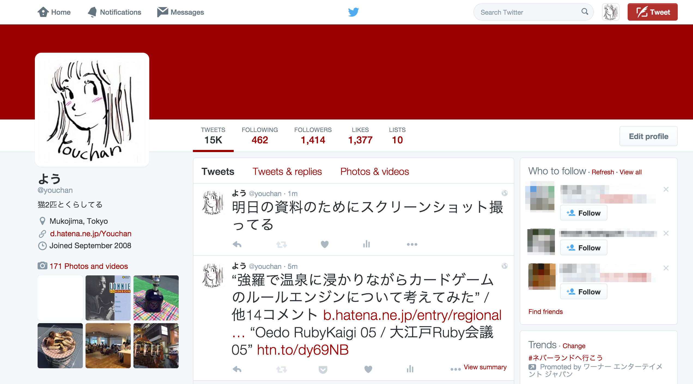
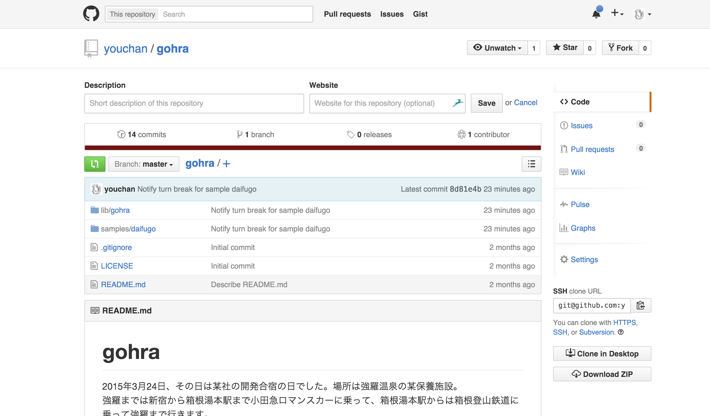
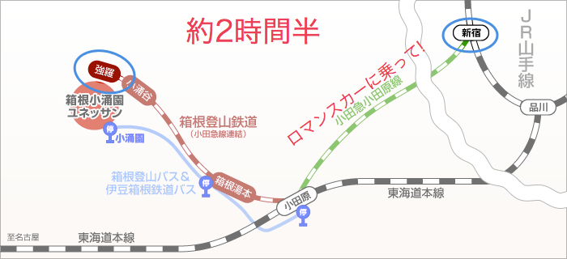
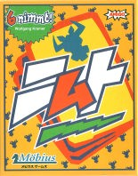
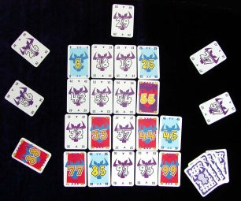
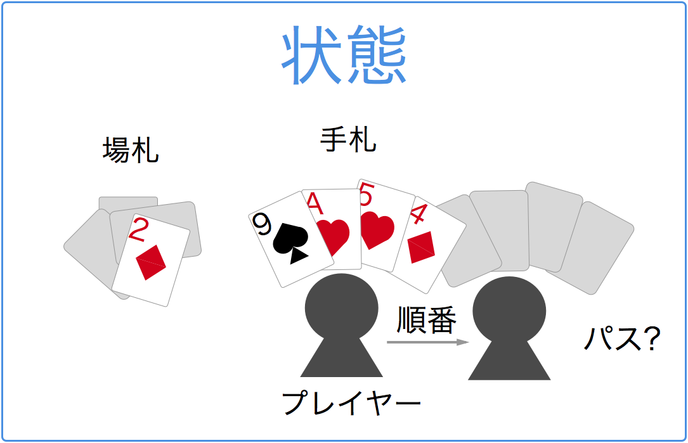
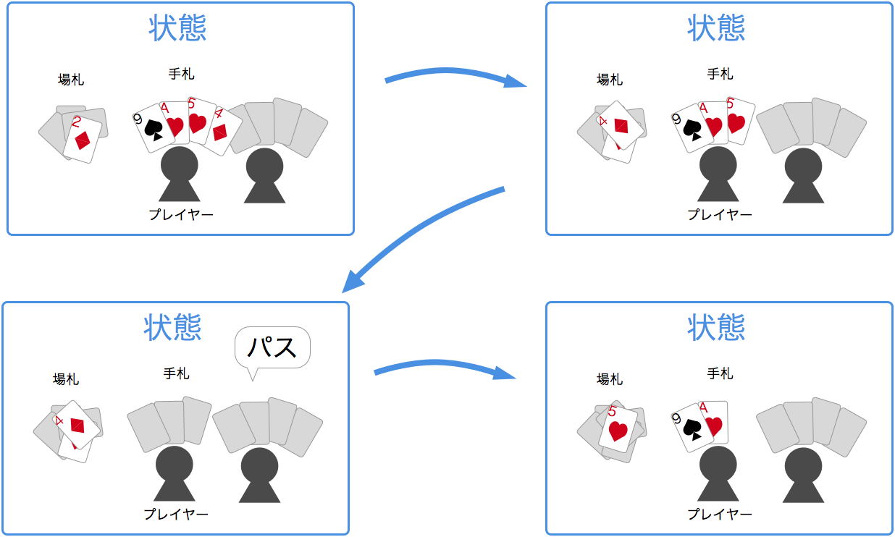
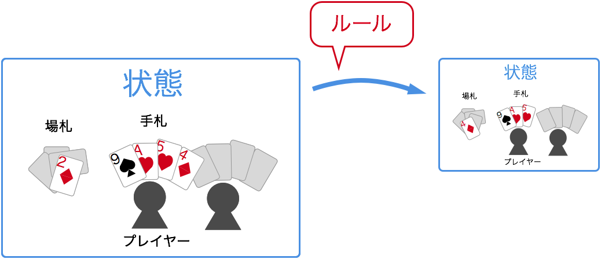

# 強羅で温泉に浸かりながらカードゲームのルールエンジンについて考えてみた
@youchan

## 誰？
* 大崎 瑶(よう)
* 株式会社ユビレジ


## @youchan


## gohra


## なぜ強羅？
開発合宿に行ってきました。

## 強羅までの道のり


## ロマンスカー


## 大富豪
* 大富豪というトランプゲームをご存知ですか？
* メンバーに大富豪を知らない人がいたけど説明してすぐ始められるくらいシンプルなルール
* ローカルルールがたくさんある
  - ♠３ > ジョーカー
  - 11バック
  - 革命

## ニムト



## ワインバルでニムトで遊んで怒られる
* 飲食店でカードゲームをやると怒られる
* カードゲームはシンプルで面白い
* なんとなくカードゲームのモデリングができそうな気がしてきた

## ゲームの状態


## ゲームの状態が刻々と変化


## 状態とルール(+ プレイヤー)


## 課題がわかった
* 状態とルールをどう記述するか？
* UIを提供する

## まずは大富豪でつくってみる

## RubyのDSLはルール記述にうってつけ

## 状態
* 状態として捉えることのできるものはすべて状態として記述
* 場札、ユーザー毎の手札などカードの状態もどこにあるかを含めて
* ユーザーがパスをしたなども状態として

## 状態のDSL
```rb
state :tableau, :cards, :any
state :used, :cards, :any
state :turns, :players
```

## プレイヤーごとの状態
```rb
player do
  state :hand, :cards, :any
  state :choice, :cards, 1..4
  state :up, :number
  state :pass, :flag, 1, false
end
```

## ルール
ルールは状態を別の状態に遷移させるもの

## ルールのDSL
```rb
rule(:put_player_choice_on_tableau) do |player|
  used << tableau
  self.tableau = player.choice.value
end

rule(:turn_break?) do |player|
  players.except(player).all? {|p| p.pass.value }
end

rule(:last_one_player?) do
  players.select(&:is_up?).count == (players.count - 1)
end
```

## バリデーションルール
```rb
rule(:validate_choice) do |cards|
  same_number_of cards
  next true if tableau.empty?
  same_count_of cards
  greater_than cards
  true
end

rule(:same_number_of) do |cards|
  validate_error cards if cards.count > 1 && cards.any? {|c| cards[0].number != c.number }
end

rule(:same_count_of) do |cards|
  validate_error cards unless tableau.count == cards.count
end
```

## 進行
いつルールが適用されるか
ユーザーとのインタラクション

## progression
```rb
progression do
  deck.shuffle
  ...

  turns.cycle do |player|
    next if player.is_up?
    if turn_break?(player)
      clear_tableau
      end_of_game if last_one_player?
    end
    player.choose_from_hand
    notify :player_choosed, player
    put_player_choice_on_tableau(player)
  end
end
```

## ユーザーインターフェース
今回はSlack

## イベント駆動
* Ruleの適用前後
* Stateの更新
* バリデーションエラー
* その他明示的にnotify

### Ruleの適用前後
```rb
after_rule :turn_break? do |params|
  if params[:result]
    @slack_user.puts "All other player passed. This turn is break."
  end
end
```

### その他明示的にnotify
```rb
player.choose_from_hand
notify :player_choosed, player
put_player_choice_on_tableau(player)
```

## Demo or Die

## 展望
* Webインタフェース
* 大好きな麻雀ゲームを作りたい

## RubyKaigi 2015


## まとめ
* 温泉に浸かりながらではなく、温泉の帰りの道中に考えました。
* 飲食店でカードゲームだめ！絶対！
* カードゲームは状態とルールそしてUI
